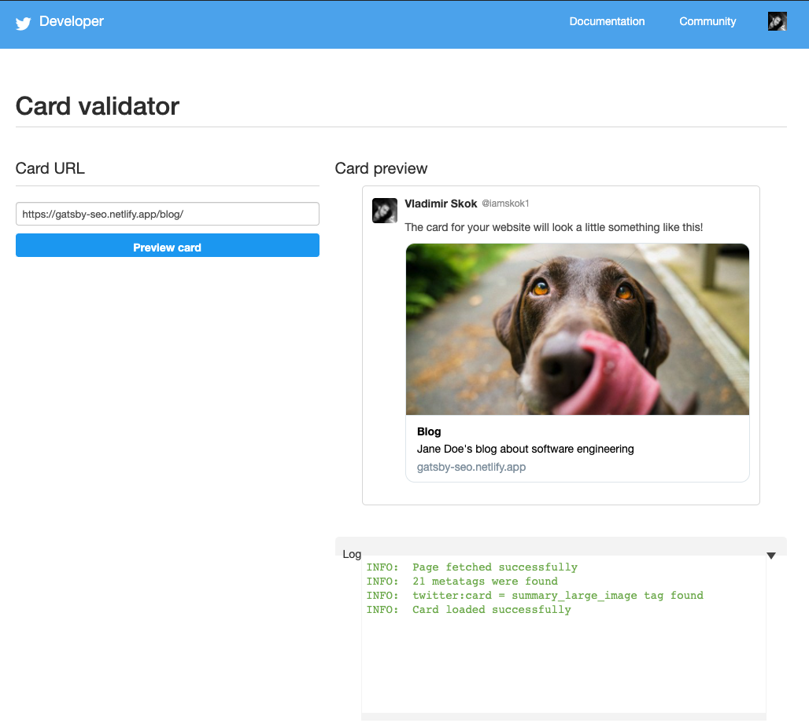
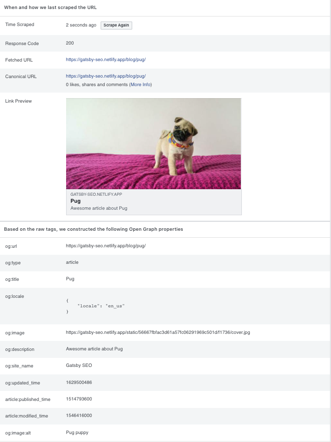
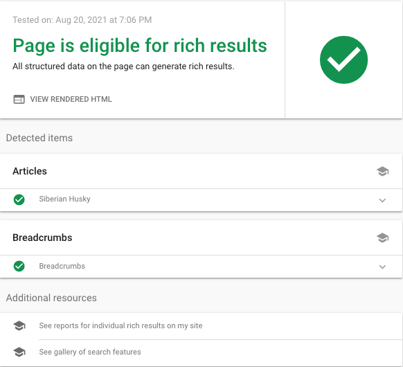

import TableOfContents from "../../../src/components/table-of-contents"
import Intro from "../../../src/components/intro"
import { Underline, BracketX } from "../../../src/components/notation"
import {
  SeriesIntro,
  CompletedProjectedLinks,
} from "../../components/gatsby-seo-series"
import {
  TwitterPlayground,
  OpenGraphPlayground,
  SchemaPlayground,
  ProjectTreePartThree,
} from "./components"

<Intro>

<SeriesIntro part="3" />

In Part 3, we will create an `SEO` component, which will render Twitter, Open Graph, and Schema.org meta tags.
Then we will cover all the necessary tools for validating the markup.

<CompletedProjectedLinks />

Let's take a few moments to familiarize ourselves with the project structure.

<ProjectTreePartThree />

</Intro>

<TableOfContents
  items={props.tableOfContentsItems}
  ids={props.tableOfContentsHeaderIds}
/>

## The `SEO` Component

The `SEO` component receives data from every page and acts as a wrapper for other, smaller components. Based on the
received data it constructs `imageUrls`, `activePages` objects, and an `url` string that is passed down the
components tree to `DefaultMeta`, `Twitter`, `OpenGraph`, and `SchemaOrg`.

```jsx fileName=src/components/SEO/index.js
import React from "react"
import DefaultMeta from "./DefaultMeta"
import OpenGraph from "./OpenGraph"
import Twitter from "./Twitter"
import SchemaOrg from "./SchemaOrg"
import useSiteMetadata from "../../hooks/useSiteMetadata"
import getActivePages from "./getActivePages"
import getImageUrls from "./getImageUrls"
import getCurrentUrl from "./getCurrentUrl"

const SEO = ({
  pathName,
  slug,
  title,
  description,
  images,
  imageAlt,
  pageId,
  type,
  breadcrumb,
  published,
  modified,
}) => {
  const {
    siteUrl,
    siteName,
    firstName,
    lastName,
    language,
    socialMedia,
    logo,
    address,
    speakableSelector,
    pages,
  } = useSiteMetadata()

  const imageUrls = getImageUrls({ images, siteUrl })
  const activePages = getActivePages({ pages, pageId })
  const url = getCurrentUrl({
    siteUrl,
    pathName,
    slug,
    pages,
    activePages,
  })

  const defaultMeta = {
    title,
    description,
    language,
    url,
  }

  const twitter = {
    title,
    description,
    imageUrls,
    imageAlt,
    socialMedia,
  }

  const openGraph = {
    siteName,
    firstName,
    lastName,
    title,
    description,
    imageUrls,
    imageAlt,
    modified,
    published,
    language,
    activePages,
    url,
  }

  const schemaOrg = {
    siteUrl,
    siteName,
    firstName,
    lastName,
    logo,
    language,
    socialMedia,
    address,
    speakableSelector,
    pathName,
    title,
    description,
    imageUrls,
    breadcrumb,
    type,
    modified,
    published,
    slug,
    pages,
    activePages,
    url,
  }

  return (
    <>
      <DefaultMeta {...defaultMeta} />
      <Twitter {...twitter} />
      <OpenGraph {...openGraph} />
      <SchemaOrg {...schemaOrg} />
    </>
  )
}

export default SEO
```

### The `getImageUrls` Helper Function

After applying the [`ImageUrlFields` fragment](/blog/gatsby-graphql-fragments/#image-url-fields-code-block)
on a File node we get back a deeply nested object with multiple relative paths. The purpose of the `getImageUrls`
function is to generate a URL for every path and pack it in a concise object.

```js fileName=src/components/SEO/getImageUrls.js
const getImageUrls = ({ images, siteUrl }) =>
  Object.entries(images).reduce((acc, image) => {
    const [
      key,
      {
        images: {
          fallback: { src: path },
        },
      },
    ] = image
    const url = `${siteUrl}${path}`
    acc[`${key}ImageUrl`] = url

    return acc
  }, {})

export default getImageUrls
```

### The `getActivePages` Helper Function

All page types have different markup templates. For example, the `/contact` page corresponds to the
[ContactPage](https://schema.org/ContactPage) schema and the `/blog/pug/` page corresponds to the
[Article](https://schema.org/Article) schema. However, there is no mechanism within the `SEO`
component to distinguish between these two pages, and therefore no way of knowing which template to use.

The `getActivePages` helper takes care of identifying the page type of the received data. It does
this by checking the `pageId` prop against a list of all pages defined in
[`site-metadata.js`](/blog/gatsby-node-and-config-files/#site-metadata). Later on, we will rely
on its output to map pages with their corresponding templates.

```js fileName=src/components/SEO/getActivePages.js id=get-active-pages-code-block
const getActivePages = ({ pages, pageId }) =>
  Object.entries(pages).reduce((acc, page) => {
    const [name, { id }] = page
    const firstLetter = name[0].toUpperCase()
    const remainingLetters = name.substr(1)
    const key = `is${firstLetter}${remainingLetters}`
    acc[key] = id === pageId

    return acc
  }, {})

export default getActivePages
```

### The `getCurrentUrl` Helper Function

`getCurrentUrl` returns the page URL based on the output from the [`getActivePages` helper](/blog/gatsby-seo-component/#get-active-pages-code-block).

```js fileName=src/components/SEO/getCurrentUrl.js
import slashify from "../../helpers/slashify"

const getCurrentUrl = ({
  siteUrl,
  pathName,
  slug,
  pages: {
    blog: { pathName: blogPathName },
  },
  activePages: { isHome, isArticle },
}) =>
  isHome
    ? siteUrl
    : isArticle
    ? slashify(siteUrl, blogPathName, slug)
    : slashify(siteUrl, pathName)

export default getCurrentUrl
```

### The `DefaultMeta` Component

Before adding the `DefaultMeta` component, we will need to install [`react-helmet`](https://github.com/nfl/react-helmet) and
its corresponding Gatsby plugin [gatsby-plugin-react-helmet](https://www.gatsbyjs.com/plugins/gatsby-plugin-react-helmet/):

```
yarn add react-helmet gatsby-plugin-react-helmet
```

Update `gatsby-config.js`:

```js fileName=gatsby-config.js
// ✂️
module.exports = {
  // ✂️
  plugins: [
    `gatsby-plugin-react-helmet`,
    // ✂️
  ],
}
```

`react-helmet` is a document head manager for React, while `gatsby-plugin-react-helmet` provides a drop-in support
for server rendering data added with React Helmet.

```jsx fileName=src/components/SEO/DefaultMeta.js
import React from "react"
import Helmet from "react-helmet"

const DefaultMeta = ({ title, description, language, url }) => {
  const lang = language.replace(`_`, `-`)

  return (
    <Helmet>
      <html lang={lang} />
      <title>{title}</title>
      <meta name="description" content={description} />
      <link rel="canonical" href={url} />
    </Helmet>
  )
}

export default DefaultMeta
```

The `Helmet` component takes your HTML tags and renders them inside of the `head` tag.
For the `lang` attribute we replace `_` on `-` to follow [BCP 47](https://www.rfc-editor.org/rfc/bcp/bcp47.txt).

### The `Twitter` Component

The `Twitter` component contains Twitter specific meta tags. When the URL on your blog
is shared via Twitter, it will be expanded in an attractive summary card with a large image.

```jsx fileName=src/components/SEO/Twitter.js
import React from "react"
import { Helmet } from "react-helmet"

const Twitter = ({
  title,
  description,
  imageUrls: { twitterImageUrl: image },
  imageAlt,
  socialMedia: { twitter: creator },
}) => (
  <Helmet>
    <meta name="twitter:card" content="summary_large_image" />
    <meta name="twitter:title" content={title} />
    <meta name="twitter:description" content={description} />
    <meta name="twitter:image" content={image} />
    <meta name="twitter:image:alt" content={imageAlt} />
    <meta
      name="twitter:creator"
      content={new URL(creator).pathname.replace(`/`, `@`)}
    />
  </Helmet>
)

export default Twitter
```

- `twitter:card` is a type of card. We use "Summary Large Image" to create a prominent,
  full-width image beside the tweet.
- `twitter:creator` is the person who wrote this content, so its value has to be a Twitter
  handle starting with the `@` symbol.

To learn more about Twitter cards, check out their [documentation](https://developer.twitter.com/en/docs/twitter-for-websites/cards/overview/markup).

<TwitterPlayground />

### The `OpenGraph` Component

The Open Graph protocol is supported by a wide range of social media platforms, including Facebook
(which created this protocol in 2010), LinkedIn, Pinterest, and Twitter (when Twitter can't find Twitter
meta tags, it reverts to Open Graph), and others. To learn more about it, you can have a look at the
[Open Graph protocol documention](https://ogp.me/).

The `OpenGraph` component renders markup based on the provided page type. This is when [getActivePages](/blog/gatsby-seo-component/#get-active-pages-code-block)
becomes handy.

```jsx fileName=src/components/SEO/OpenGraph.js
import React from "react"
import { Helmet } from "react-helmet"

const OpenGraph = ({
  siteName,
  firstName,
  lastName,
  title,
  description,
  imageUrls: { openGraphImageUrl: image },
  imageAlt,
  modified,
  published,
  language,
  activePages: { isArticle },
  url,
}) => (
  <Helmet>
    <meta property="og:type" content={isArticle ? `article` : `website`} />
    <meta property="og:url" content={url} />
    <meta property="og:site_name" content={siteName} />
    <meta property="og:locale" content={language} />
    <meta property="og:title" content={title} />
    <meta property="og:description" content={description} />
    <meta property="og:image" content={image} />
    <meta property="og:image:alt" content={imageAlt} />

    {isArticle && published && (
      <meta property="article:published_time" content={published} />
    )}
    {isArticle && modified && (
      <meta property="article:modified_time" content={modified} />
    )}
    {isArticle && (
      <meta property="article:author" content={`${firstName} ${lastName}`} />
    )}
  </Helmet>
)

export default OpenGraph
```

- `og:type` is the type of object represented in Open Graph (e.g. music, video, website, profile, article,
  etc.). In our case, this will be article when rendered inside of the [`Article` page component](/blog/gatsby-graphql-fragments/#article-component-code-block),
  and website for the rest of the pages.
- `og:url` is the canonical URL of the object.
- `og:locale` is the language of the content (when not specified, this defaults to `en_US`).

The following tags will be rendered only in the `Article` template:

- `article:author`
- `article:published_time`
- `article:modified_time`

<OpenGraphPlayground />

### What is Schema.org?

Schema.org is a structured data markup that helps search engines interpret the content of web pages. It was initially
launched in 2011 by Google, Yahoo, and Bing. Once added to a webpage, <Underline>it conveys the contextual meaning to search engines
by using a hierarchical set of schemas.</Underline>

HTML cannot provide the meaning of a text string. For example, a webpage can include a header of `<h1>Apple</h1>`, yet it
remains unclear whether it is referring to the fruit or the company. This is when Schema.org comes into play to provide semantic meaning to search engines.

The [Schema.org vocabulary](https://schema.org/docs/full.html) is vast, so for practical reasons, we will focus
only on the schemas that Google officially supports. This way, we are going to help the search engines and
benefit from rich results in the process (aka [rich snippets](https://developers.google.com/search/docs/guides/search-gallery) which
are normal Google search results with additional data displayed). Rich snippets stand out from the other search
results, look more appealing, and have a higher click-through rate.


Before jumping into the code, we should clarify what a node identifier is. A node identifier is a unique `@id` property
that gets attached to a schema and can be referenced from inside another schema. This is extremely useful for
keeping the code DRY and readable.

Take a look at this example:

```html id=node-identifier-code-block
<script type="application/ld+json">
  {
    "@context": "https://schema.org",
    "@type": "PostalAddress",
    "@id": "https://example.com/#address",
    "addressCountry": "US",
    "addressLocality": "Los Angeles",
    "addressRegion": "CA"
  }
</script>
<script type="application/ld+json">
  {
    "@context": "https://schema.org",
    "@type": "Person",
    "@id": "https://example.com/#person",
    "name": "Jane Doe",
    "address": {
      "@id": "https://example.com/#address"
    }
  }
</script>
<script type="application/ld+json">
  {
    "@context": "https://schema.org",
    "@id": "https://example.com/#organization",
    "@type": "Organization",
    "url": "https://example.com",
    "name": "Gatsby SEO",
    "logo": {
      "@type": "ImageObject",
      "url": "https://example.com/logo.jpg",
      "height": 640,
      "width": 640
    },
    "address": {
      "@id": "https://example.com/#address"
    }
  }
</script>
```

In the above example, we created a `PostalAddress` schema and then referenced it inside of the `Person` and
`Organization` schemas by passing its node identifier ID. If we don't take advantage of node identifiers, we will end up
having to duplicate the whole `PostalAddress` object inside the `Person` and `Organization` schemas.

The node identifier value can be pretty much anything, but the standard practice is to use the domain name appended with
the number sign and the schema type name as follows: `https://example.com/#schema`.

### The `SchemaOrg` Component

In the `SchemaOrg` component we generate address, person, organization, breadcrumb, and page (`WebPage`, `Blog`,
`ContactPage`, `AboutPage`, or `Article`) schemas, link them together using [node identifiers](/blog/gatsby-seo-component/#node-identifier-code-block)
and compose into a single JSON object.

```jsx fileName=src/components/SEO/SchemaOrg.js
import React from "react"
import Helmet from "react-helmet"
import slashify from "../../helpers/slashify"

const SchemaOrg = ({
  siteUrl,
  siteName,
  firstName,
  lastName,
  logo: { pathName: logoPathName, width: logoWidth, height: logoHeight },
  language,
  socialMedia: { twitter, github },
  address,
  speakableSelector,
  pathName,
  title,
  description,
  imageUrls: {
    schemaOrg1x1ImageUrl,
    schemaOrg4x3ImageUrl,
    schemaOrg16x9ImageUrl,
  },
  breadcrumb,
  type,
  modified,
  published,
  slug,
  pages: {
    home: { breadcrumb: homeBreadcrumb },
    blog: { breadcrumb: blogBreadcrumb, pathName: blogPathName },
  },
  activePages: { isHome, isBlog, isAbout, isContact, isArticle },
  url,
}) => {
  const schemaId = id => `${siteUrl}/#${id}`

  const fullName = `${firstName} ${lastName}`
  const pageUrl = slashify(siteUrl, pathName)
  const blogPageUrl = slashify(siteUrl, blogPathName)
  const articlePageUrl = slashify(siteUrl, blogPathName, slug)

  const schemaOrgAddress = {
    "@type": `PostalAddress`,
    "@id": schemaId(`address`),
    ...address,
  }

  const schemaOrgPerson = {
    "@type": `Person`,
    "@id": schemaId(`person`),
    url: siteUrl,
    name: fullName,
    sameAs: [twitter, github],
    address: {
      "@id": schemaId(`address`),
    },
  }

  const schemaOrgOrganization = {
    "@id": schemaId(`organization`),
    "@type": `Organization`,
    url: siteUrl,
    name: siteName,
    logo: {
      "@type": `ImageObject`,
      url: slashify(siteUrl, logoPathName),
      height: logoHeight,
      width: logoWidth,
    },
    address: {
      "@id": schemaId(`address`),
    },
  }

  const schemaOrgPage = Object.assign(
    {
      "@type": type,
      author: { "@id": schemaId(`person`) },
      publisher: { "@id": schemaId(`organization`) },
      description,
      headline: title,
      inLanguage: language,
      name: title,
      url,
      mainEntityOfPage: url,
      image: [
        schemaOrg1x1ImageUrl,
        schemaOrg4x3ImageUrl,
        schemaOrg16x9ImageUrl,
      ],
    },
    isArticle &&
      published && {
        datePublished: published,
      },
    isArticle && modified
      ? { dateModified: modified }
      : published
      ? { dateModified: published }
      : null,
    !isBlog &&
      speakableSelector && {
        speakable: {
          "@type": `SpeakableSpecification`,
          cssSelector: speakableSelector,
        },
      }
  )

  const breadcrumbList = [
    {
      id: siteUrl,
      name: homeBreadcrumb,
    },
  ]

  if (isBlog || isContact || isAbout) {
    breadcrumbList.push({
      id: pageUrl,
      name: breadcrumb,
    })
  } else if (isArticle) {
    breadcrumbList.push(
      {
        id: blogPageUrl,
        name: blogBreadcrumb,
      },
      {
        id: articlePageUrl,
        name: title,
      }
    )
  }

  const schemaOrgBreadcrumbs = {
    "@type": `BreadcrumbList`,
    "@id": schemaId(`breadcrumbs`),
    name: `Breadcrumbs`,
    itemListElement: breadcrumbList.map(({ id, name }, index) => ({
      "@type": `ListItem`,
      position: index + 1,
      name,
      item: {
        "@type": `WebPage`,
        "@id": id,
      },
    })),
  }

  const schemaOrg = {
    "@context": "http://schema.org",
    "@graph": [
      schemaOrgAddress,
      schemaOrgPerson,
      schemaOrgOrganization,
      schemaOrgPage,
    ],
  }

  if (!isHome) {
    schemaOrg["@graph"].push(schemaOrgBreadcrumbs)
  }

  return (
    <Helmet>
      <script type="application/ld+json">{JSON.stringify(schemaOrg)}</script>
    </Helmet>
  )
}

export default SchemaOrg
```

- `PostalAddress` consists of `country`, `locality`, and `region` fields.
- `Person` consists of `name`, `url` (root URL), `sameAs` (list of social media profiles) and `address` fields.
- `Organization` consists of `url`, `name`, `address` (reference to the `PostalAddress` schema), and `logo` fields.

<BracketX>

Now let's add the `logo.jpg` image to the `./static` directory. Any file you put into this directory will be
copied to the public directory. For instance, if you add a file named `dog.jpg` to the static directory,
it’ll be copied to `public/dog.jpg` and become available at the `https://<SITE_URL>/dog.jpg` URL.

</BracketX>

Once we are done with the smaller pieces, we can move on to the generic page schema. This will generate `WebPage`,
`Blog`, `ContactPage`, `AboutPage`, and `Article` schemas. Here is the list of properties that
are shared in all of these schemas:

- `type`
- `name`
- `description`
- `author`
- `publisher`
- `headline`
- `inLanguage`
- `url`
- `mainEntityOfPage`
- `image`

The rest of the properties will be added conditionally depending on the page type. The article schema requires
`datePublished`, and `dateModified`, and the blog schema contains `speakable` field.

To conditionally add properties to the object, we leverage the `Object.assign` method. To avoid duplicating the
`datePublished` value in `dateModified` for every new blog post, we check if `dateModified` exists and then apply
it. Otherwise, we reuse the `datePublished` value as `dateModified`.

The `breadcrumbList` schema doesn't appear to be a part of any other schema. It consists of a chain of linked web pages.
The position property is used to order the items and starts with `1`. The home page will always be the first item, which
is why we define `breadcrumbList` with `siteUrl` right away. The second level is a blog, contact, or about page.
With our [URL structure](/blog/gatsby-graphql-fragments/#page-components-and-url-structure-overview), the third level will always
be an article and always go after the blog page. That's why we push both of these values to the `breadcrumbList`
array at once.

Once all the schemas are constructed, we create a node array using `@graph` and fill it in with schemas. The only
edge case we need to handle is `breadcrumbList` on the home page. There is no reason to have to, so it needs to be excluded by
checking the `isHome` variable.

<SchemaPlayground />

## `SEO` Component Validation

To validate Twitter meta tags, use the [Twitter Card Validator](https://cards-dev.twitter.com/validator) tool. Make sure
that you are testing production URLs, because this tool respects [`robots.txt` settings](/blog/gatsby-sitemap-and-robots-txt-files/#robotstxt).



For Open Graph validation, use the [Facebook Sharing Debugger](https://developers.facebook.com/tools/debug). The Facebook sharing debugger caches results, so if you don't see the latest changes, click
the "Scrape Again" button to fetch the latest version of the page. After clicking the debug button, you will most likely see a
warning - "The following required properties are missing: `fb:app_id`". Don't panic! The `fb:app_id`
meta tag is not required and it doesn’t do anything nowadays anyway.



For schema.org validation, I recommend using [Google Rich Results](https://search.google.com/test/rich-results) in conjunction with
the [Schema.org Validator](https://validator.schema.org/). In my experience, there are times that
Google Rich Results will not find specific issues whereas Schema.org Validator will, and vice versa.


